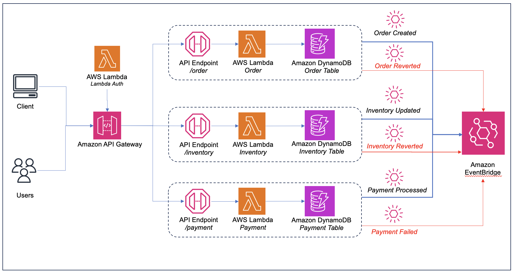

## Build Saga Choreography Pattern on AWS

Saga design pattern is used to preserve data integrity in distributed transactions that span multiple services. 

A saga consists of a sequence of local transactions. Each local transaction in a saga updates the database and initiates the next local transaction. If a transaction fails, the saga runs compensating transactions to revert the database changes made by the previous transactions.

Saga design pattern has two variants - Choreography and Orchestration.
The saga choreography pattern is Event Driven. The saga participants subscribe to the events and act based on the event details. They coordinate among themselves over a messaging system and there is no central-hub or an orchestrator to coordinate the flow of transactions.

## Architecture

The source code in this repo provides sample code for implementation of the saga choreography pattern on AWS. Below diagram depicts the architecture created by this source code.

1. It has three services, namely - Order, Inventory and Payment services which are implemnted as Lambdas.
2. Each service is exposed through an APIGateway endpoint.
3. Each service has a data store - implemnted as DynamoDB tables.
4. Each services publishes messages and consumes them on Amazon EventBridge.




## License

This library is licensed under the MIT-0 License. See the LICENSE file.

## Prerequisites

For this walkthrough, you need:
- An [AWS](https://signin.aws.amazon.com/signin?redirect_uri=https%3A%2F%2Fportal.aws.amazon.com%2Fbilling%2Fsignup%2Fresume&client_id=signup) account
- An AWS user with AdministratorAccess (see the [instructions](https://console.aws.amazon.com/iam/home#/roles%24new?step=review&commonUseCase=EC2%2BEC2&selectedUseCase=EC2&policies=arn:aws:iam::aws:policy%2FAdministratorAccess) on the [AWS Identity and Access Management](http://aws.amazon.com/iam) (IAM) console)
- Access to the following AWS services: Amazon API Gateway, AWS Lambda, Amazon EventBridge and Amazon DynamoDB.
- [Node.js](https://nodejs.org/en/download/) installed
- AWS CLI
- AWS CDK Toolkit
- Docker or Docker Desktop for Windows
- [Postman](https://www.postman.com/downloads/) to make the API call

## Setting up the environment

The CDK code in this repository creates the target architecture as shown in the above diagram. These include IAM roles, REST API on API Gateway, DynamoDB tables, Amazon EventBridge event buses and Lambda functions.

1. You need an AWS access key ID and secret access key for configuring the AWS Command Line Interface (AWS CLI).
2. Clone the repo:
```bash
git clone git@ssh.gitlab.aws.dev:vaibhvmi/saga-choreography.git
```
3. Start Docker or Docker Desktop.

4. The cdk synth command causes the resources defined in the application to be translated into an AWS CloudFormation template. The cdk deploy command deploys the stacks into your AWS account. Run:
```bash
cdk synth 
cdk deploy
```
5. CDK deploys the environment to AWS. You can monitor the progress using the CloudFormation console. The stack name shall be SagaChoreographyStack.

## Security

See [CONTRIBUTING](CONTRIBUTING.md#security-issue-notifications) for more information.

## Useful commands

 * `npm run build`   compile typescript to js
 * `npm run watch`   watch for changes and compile
 * `npm run test`    perform the jest unit tests
 * `cdk deploy`      deploy this stack to your default AWS account/region
 * `cdk diff`        compare deployed stack with current state
 * `cdk synth`       emits the synthesized CloudFormation template

